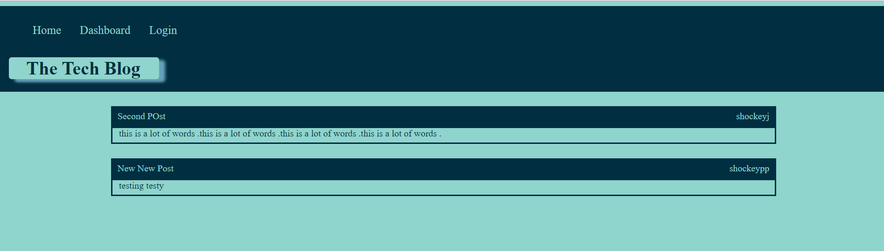
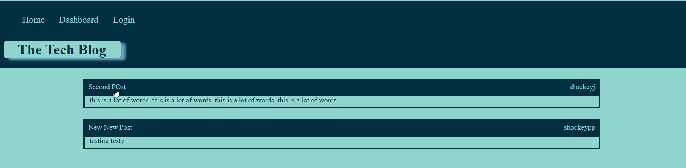
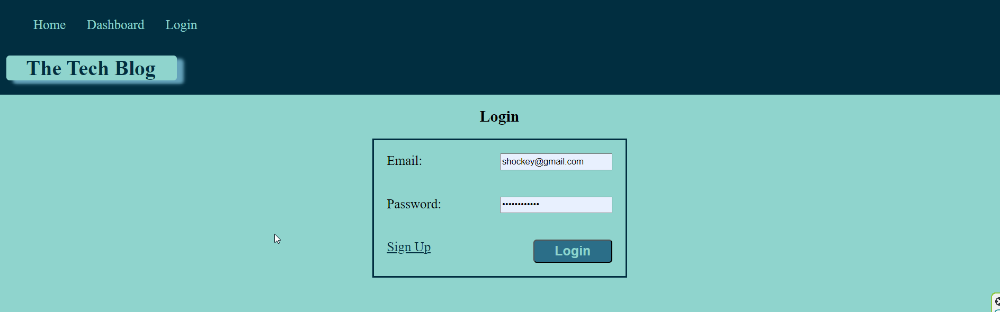
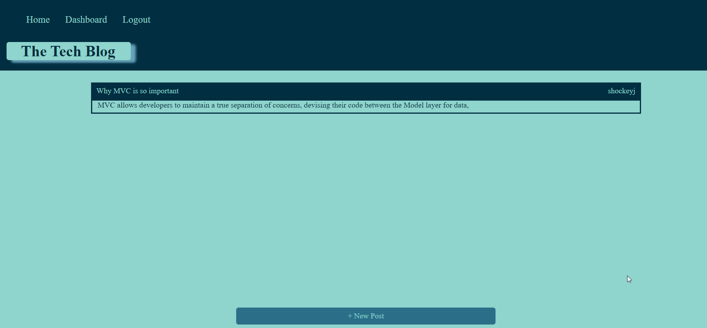
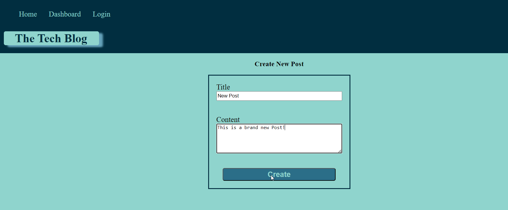
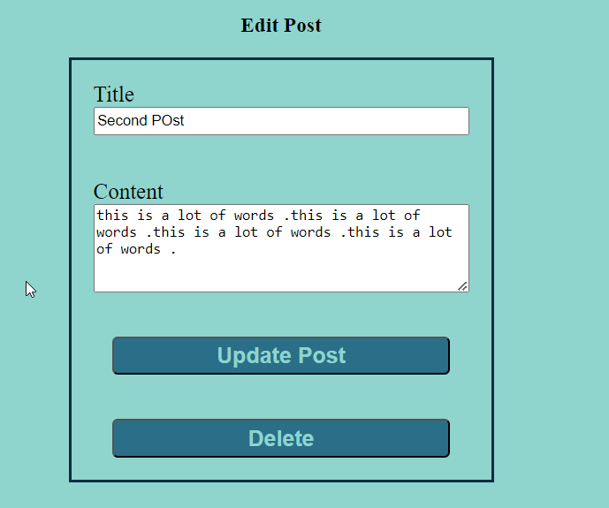
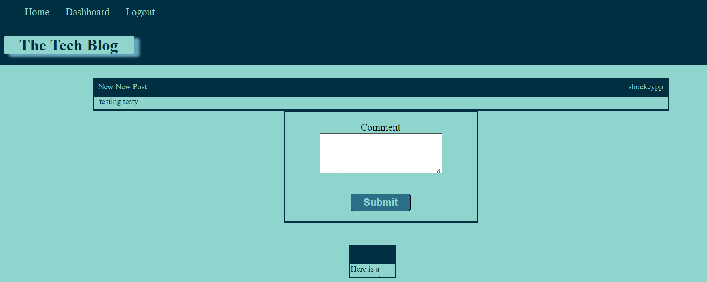

# The Tech Blog | 14 Weekly Challenge 

## Description

This is a CMS-style blog application which allows users to publish blog posts, and comment on other user's posts as well. 

This application can be viewed through Heroku:
https://secure-lake-23007-c67a5dc9b503.herokuapp.com/

## Table of Contents

  1. [ Description ](#description)
  2. [ Installation ](#installation)
  3. [ Usage ](#usage)
  3. [ License ](#license)
  3. [ How to Contribute ](#how-to-contribute)
  3. [ Questions ](#questions)
  
## Installation

* dotenv
    * `npm install dotenv`
    * Then import `require('dotenv').config()`
    * Create a .env file in the root of your project
* express
    * `npm install express`
    * Then import `const express = require('express')`
* mysql2
    * `npm install mysql2`
    * Then import `const mysql = require('mysql2')`
* sequelize
    * `npm install sequelize`
    * Then import `const { Sequelize } = require('sequelize');`

## Usage

This application is used to share blog posts and create an online forum allowing users to interact with one another in a collaborative environment. 

When user's first visit the application they are able to see all blog posts, if any exist:

If the user selects a post, when not signed in, they are routed to the login page:

If a user does not have an account they can select the "Sign in" link to be redirected to a Sign Up page.

Once signed in the user can select Dashboard to view all of the posts they've created:

User's can select the New Post button to create a new Blog Post:

User's can also select an existing post, and have the ability to Update or Delete it:

User's also have the ability to comment on other user's Blogs:

## License

http://choosealicense.com/licenses/mit/ 

A short and simple permissive license with conditions only requiring preservation of copyright and license notices. Licensed works, modifications, and larger works may be distributed under different terms and without source code. 

## How to Contribute

Please do not contribute, this project is not maintained.

## Questions

Please visit my GitHub profile [shockeyj9](https://github.com/shockeyj9)

Feel free to reach out with any questions: shockeyjessie92@gmail.com

